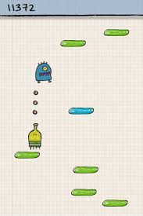
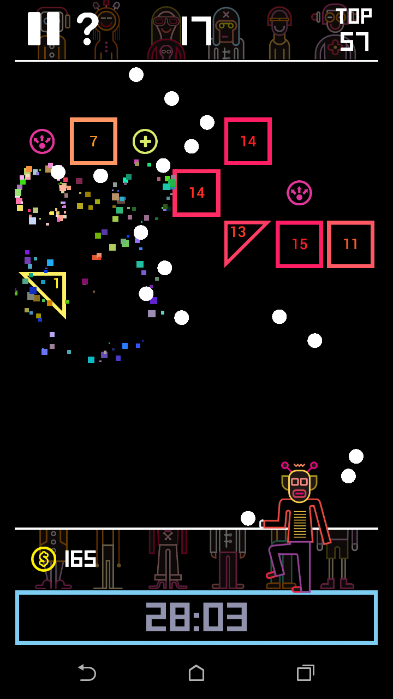

# Daily Programming of Joys (DPJ) 
## Group members:
   * 60130500201 Changhyeon Cho (Joey)
   * 60130500203 Kritchagamol Sannarong (Drive)
   * 60130500219 Patipol Saechan (Pon) 
   
## Last year video
  * https://drive.google.com/open?id=0B-CdE0h2VaLEdzBsNndQQXNsTHM
  
## Project Green_Foot
  * Project Name: Not decided 
  * For project green foot in CSC105

## Requirements:
Scope
  * 2D/Birdeye
  * 8 bits (not confirmed )
  * กวนตีน
  * score
  * stage
  * mission (not confirmed )
  * Ranks (Star) / Reward for each mission
  * Difficulties - Easy/Medium/Hard
  * Intercace
  * Charectors
  * Sound effect
  * Consideration about game playing time (maybe less than 3 min)
  * method (explanation)

## IDEAS: 
 1. Making a game 
 2. Simulation
 3. Educational teaching (Logic gate - COA)
 
 ### Game Samples:
  * Big hunter (app game)
    - https://play.google.com/store/apps/details?id=com.kakarod.bighunter&hl=th
    - Casual game that upgrading your ability to score high
    - Need to think about how we create to pc version?
    - Horizontal movemnet game with throwing throwable things to add damage to score high
    - Think about throwing curve or straight
    
  * Space Frontier (app game)
    - https://play.google.com/store/apps/details?id=com.ketchapp.spacefrontier&hl=th
    - Casual game that upgrade your ability to score high
    - Transfer to pc version
    - Vertical movement game with earning coins depends on how high the spaceship goes.
    - 
    
  * Towel depends (app/pc)
    - Tactical game
    - Fix area with different upgrade cost and higher damage
    -
    
  * Bomberman (pc)
    - http://th.y8.com/tags/Bomberman
    - Action game
    - Using bomb to get a item from block and defeat enemy
    - 
    
  * Trap adv (app)
    - https://play.google.com/store/apps/details?id=com.TrapAdventure.Trap_Adventure2
    - Advanture game
    - Charector needs to escape and reach at final goal
    - There are obstacle trap to make game harder
    - Horizontal move
    
  * InstLife (app)
    - https://play.google.com/store/apps/details?id=com.instcoffee.instlife&hl=th
    - Simulation game about life
    - No graphic (can add and improve)
    - There are menu and options to select
     
    
      
 

    
  * Dudo Jump (app)
    - https://play.google.com/store/apps/details?id=com.lima.doodlejump&hl=th
    - Adventure Game
    - Character need to jump among the monster upper sky
    
    
    
 

    
  * BB_Tan (app)
    - https://play.google.com/store/apps/details?id=com.crater.bbtan
    - Shoot the ball to the block in each mission
    - Each block have their own number ( If the block is number 20 so you need to hit them 20 times )
    - They're so many type of balls ( you can change the balls / each ball are difference size, They're unlock from Gacha)
    - the block will incressing one row everytime you shoot
    - Time Count System
    - Number of balls are limited
    
    
    
## Note:
  * Color path for walking charector (advanture)
  * Use block to make a path
  * 
  
  
  
    
